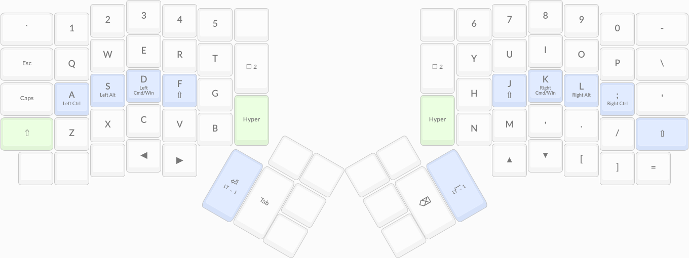
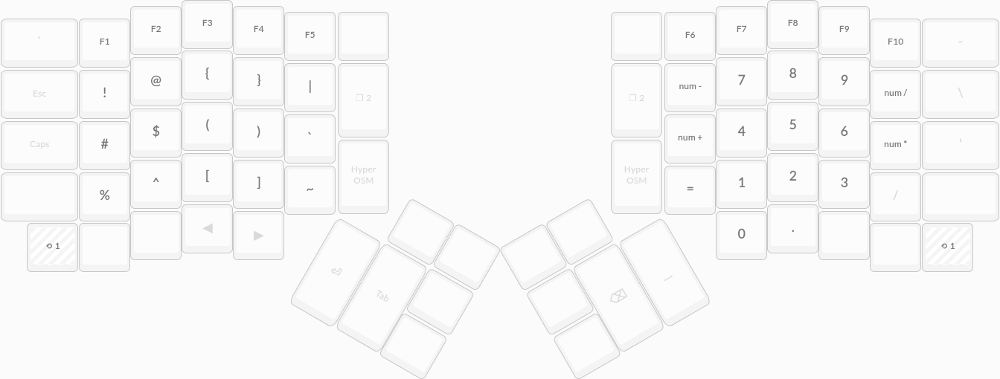
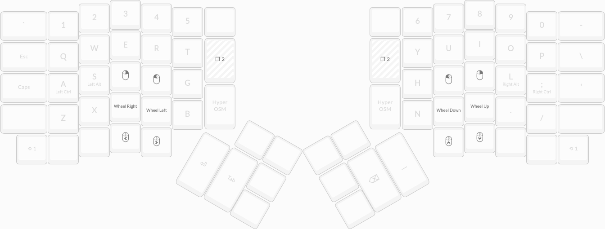

Ergodox EZ Layout
=================

This is the layout I currently use on my Ergodox EZ keyboard. Key
features include

-   Home-row modifiers via dual-function keys
-   Minimal use of thumb clusters to avoid finger spread
-   Number block and mouse control on secondary layers

[Source](src)

[Compiled layout](3vqYw.hex)

[ORYX online editor](https://configure.ergodox-ez.com/ergodox-ez/layouts/3vqYw/latest/0)

Layers
------

License
-------

The contents of this repository are licensed under the MIT license. See
[COPYING](COPYING) for further details.
